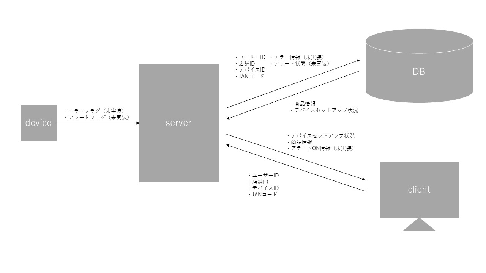
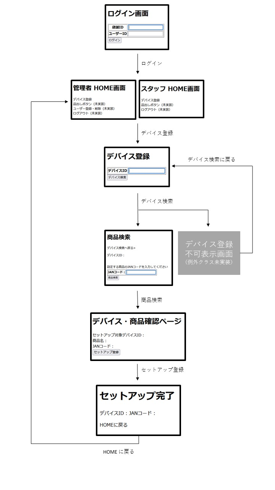
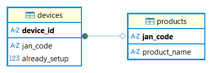
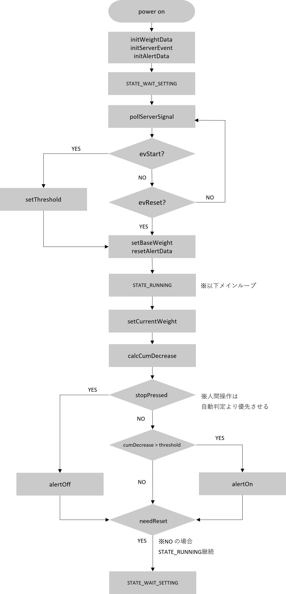

# WeightDetector

## 概要
店舗における大量万引き対策を目的とし、重量センサーを用いて商品棚の重量変化を検知することで、短時間での大量商品持ち出しを検出する **IoT システムの模擬実装ポートフォリオ**です。

---

## ユースケース
人手の少ない時間帯において、店舗スタッフが他業務を行っている間に、高額商品がまとめて持ち去られるケースを想定しています。

---

## 技術スタック
- デバイス : C言語
- サーバ : Java（SpringBoot）
- フロントエンド : Thymeleaf
- データベース : MySQL

---

## システム構成（データフロー）

- **C** : センサー制御・重量取得（判定結果をフラグとして出力）
- **Java（SpringBoot）** : エラー・アラート状態の管理、業務ロジック

---

## リポジトリ構成

| ディレクトリ名 | 内容 |
|---------------|------|
| app_java      | Spring Boot による管理サーバ |
| iot_device    | C言語による重量センサー制御ロジック |
| images        | README 用の図表・画像 |
| docs          | 詳細仕様書 |

---

## 機能一覧

- 店舗スタッフログイン（模擬）
- デバイス状態表示
- 重量差分による異常検知
- アラート制御
- 管理画面（Thymeleaf）

---

## 画面遷移図

---

## データベース設計（ER図）

データベースはテスト用の仮テーブルを作成して検証しています。

---

## センサー制御

重量取得 → 閾値判定 → アラート制御 の流れでハードウェアを想定したシミュレーション実装を行っています。

---

## 未実装機能（今後の拡張案）

- デバイス（C言語）
  - 実機への接続実装
  - アラートやフラグのログ収集
  - ログ転送処理
- サーバ側（Java / SpringBoot）
  - SpringSecurity によるログイン機能の実装
  - 実機稼働状況の取得およびデバイスの管理、アラートの管理
  - ログ処理の実装

---

## 仕様書

詳細仕様書はこちら : [WeightDetector仕様書](docs/WeightDetector_Spec.pdf)

---

本プロジェクトは未経験からのSE転職を目的に、実務の開発プロセス（設計→実装→拡張設計）を模擬して開発しました。